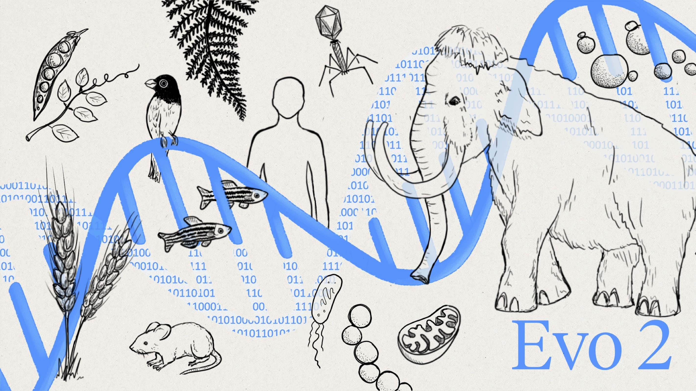

# Evo 2: Genome modeling and design across all domains of life



Evo 2 is a state of the art DNA language model for long context modeling and design. Evo 2 models DNA sequences at single-nucleotide resolution at up to 1 million base pair context length using the [StripedHyena 2](https://github.com/Zymrael/savanna/blob/main/paper.pdf) architecture. Evo 2 was pretrained using [Savanna](https://github.com/Zymrael/savanna). Evo 2 was trained autoregressively on [OpenGenome2](https://huggingface.co/datasets/arcinstitute/opengenome2), a dataset containing 8.8 trillion tokens from all domains of life.

We describe Evo 2 in the preprint:
["Genome modeling and design across all domains of life with Evo 2"](https://www.biorxiv.org/content/10.1101/2025.02.18.638918v1).

## Contents

- [Setup](#setup)
  - [Requirements](#requirements)
  - [Installation](#installation)
- [Checkpoints](#checkpoints)
- [Usage](#usage)
  - [Forward](#forward)
  - [Embeddings](#embeddings)
  - [Generation](#generation)
  - [Notebooks](#notebooks)
  - [Nvidia NIM](#nvidia-nim)
- [Dataset](#dataset)
- [Training and Finetuning](#training-and-finetuning)
- [Citation](#citation)

## Setup

This repo is for running Evo 2 locally for inference or generation, using our [Vortex](https://github.com/Zymrael/vortex) inference code. For training and finetuning, see the section [here](#training-and-finetuning).
You can run Evo 2 without any installation using the [Nvidia Hosted API](https://build.nvidia.com/arc/evo2-40b).
You can also self-host an instance using Nvidia NIM. See the [Nvidia NIM](#nvidia-nim) section for more 
information.

### Requirements

Evo 2 is based on [StripedHyena 2](https://github.com/Zymrael/vortex) which requires python>=3.11. Evo 2 uses [Transformer Engine](https://github.com/NVIDIA/TransformerEngine) FP8 for some layers which requires an H100 (or other GPU with compute capability ≥8.9). We are actively investigating ways to avoid this requirement.

### Installation

To install Evo 2 for inference or generation, please clone and install from GitHub. We recommend using a new conda environment with python>=3.11.

```bash
git clone --recurse-submodules git@github.com:ArcInstitute/evo2.git
cd evo2
pip install .
```

If this did not work for whatever reason, you can also install from [Vortex](https://github.com/Zymrael/vortex) and follow the instructions there. PyPi support coming soon!

You can check that the installation was correct by running a test.

```
python ./test/test_evo2.py --model_name evo2_7b
```

## Checkpoints

We provide the following model checkpoints, hosted on [HuggingFace](https://huggingface.co/arcinstitute):
| Checkpoint Name                        | Description |
|----------------------------------------|-------------|
| `evo2_40b`  | A model pretrained with 1 million context obtained through context extension of `evo2_40b_base`.|
| `evo2_7b`  | A model pretrained with 1 million context obtained through context extension of `evo2_7b_base`.|
| `evo2_40b_base`  | A model pretrained with 8192 context length.|
| `evo2_7b_base`  | A model pretrained with 8192 context length.|
| `evo2_1b_base`  | A smaller model pretrained with 8192 context length.|

To use Evo 2 40B, you will need multiple GPUs. Vortex automatically handles device placement, splitting the model across available cuda devices.

## Usage

Below are simple examples of how to download Evo 2 and use it locally in Python.

### Forward

Evo 2 can be used to score the likelihoods across a DNA sequence.

```python
import torch
from evo2 import Evo2

evo2_model = Evo2('evo2_7b')

sequence = 'ACGT'
input_ids = torch.tensor(
    evo2_model.tokenizer.tokenize(sequence),
    dtype=torch.int,
).unsqueeze(0).to('cuda:0')

outputs, _ = evo2_model(input_ids)
logits = outputs[0]

print('Logits: ', logits)
print('Shape (batch, length, vocab): ', logits.shape)
```

### Embeddings

Evo 2 embeddings can be saved for use downstream. We find that intermediate embeddings work better than final embeddings, see our paper for details.

```python
import torch
from evo2 import Evo2

evo2_model = Evo2('evo2_7b')

sequence = 'ACGT'
input_ids = torch.tensor(
    evo2_model.tokenizer.tokenize(sequence),
    dtype=torch.int,
).unsqueeze(0).to('cuda:0')

layer_name = 'blocks.28.mlp.l3'

outputs, embeddings = evo2_model(input_ids, return_embeddings=True, layer_names=[layer_name])

print('Embeddings shape: ', embeddings[layer_name].shape)
```

### Generation

Evo 2 can generate DNA sequences based on prompts.

```python
from evo2 import Evo2

evo2_model = Evo2('evo2_7b')

output = evo2_model.generate(prompt_seqs=["ACGT"], n_tokens=400, temperature=1.0, top_k=4)

print(output.sequences[0])
```

### Notebooks

We provide example notebooks.

The [BRCA1 notebook](https://github.com/ArcInstitute/evo2/blob/main/notebooks/brca1/brca1_zero_shot_vep.ipynb) shows zero-shot *BRCA1* variant effect prediction. This example includes a walkthrough of:
- Performing zero-shot *BRCA1* variant effect predictions using Evo 2
- Reference vs alternative allele normalization

The [generation notebook](https://github.com/ArcInstitute/evo2/blob/main/notebooks/generation/generation_notebook.ipynb) shows DNA sequence completion with Evo 2. This example shows:
- DNA prompt based generation and 'DNA autocompletion'
- How to get and prompt using phylogenetic species tags for generation

### Nvidia NIM

Evo 2 is available on [Nvidia NIM](https://catalog.ngc.nvidia.com/containers?filters=&orderBy=scoreDESC&query=evo2&page=&pageSize=) and [hosted API](https://build.nvidia.com/arc/evo2-40b).

- [Documentation](https://docs.nvidia.com/nim/bionemo/evo2/latest/overview.html)
- [Quickstart](https://docs.nvidia.com/nim/bionemo/evo2/latest/quickstart-guide.html)

The quickstart guides users through running Evo 2 on the NVIDIA NIM using a python or shell client after starting NIM. An example python client script is shown below. This is the same way you would interact with the [Nvidia hosted API](https://build.nvidia.com/arc/evo2-40b?snippet_tab=Python).

```python
#!/usr/bin/env python3
import requests
import os
import json
from pathlib import Path

key = os.getenv("NVCF_RUN_KEY") or input("Paste the Run Key: ")

r = requests.post(
    url=os.getenv("URL", "https://health.api.nvidia.com/v1/biology/arc/evo2-40b/generate"),
    headers={"Authorization": f"Bearer {key}"},
    json={
        "sequence": "ACTGACTGACTGACTG",
        "num_tokens": 8,
        "top_k": 1,
        "enable_sampled_probs": True,
    },
)

if "application/json" in r.headers.get("Content-Type", ""):
    print(r, "Saving to output.json:\n", r.text[:200], "...")
    Path("output.json").write_text(r.text)
elif "application/zip" in r.headers.get("Content-Type", ""):
    print(r, "Saving large response to data.zip")
    Path("data.zip").write_bytes(r.content)
else:
    print(r, r.headers, r.content)
```


### Very long sequences

We are actively working on optimizing performance for long sequence processing in Vortex. Vortex can currently compute over very long sequences via teacher prompting. However please note that forward pass on long sequences may currently be slow. You can instead use [Savanna](https://github.com/Zymrael/savanna) or [Nvidia BioNemo](https://github.com/NVIDIA/bionemo-framework) for embedding long sequences.

### Dataset

The OpenGenome2 dataset used for pretraining Evo2 is available on [HuggingFace ](https://huggingface.co/datasets/arcinstitute/opengenome2). Data is available either as raw fastas or as JSONL files which include preprocessing and data augmentation.

### Training and Finetuning

Evo 2 was trained using [Savanna](https://github.com/Zymrael/savanna), an open source framework for training alternative architectures.

To train or finetune Evo 2, you can use [Savanna](https://github.com/Zymrael/savanna) or [Nvidia BioNemo](https://github.com/NVIDIA/bionemo-framework) which provides a [Evo 2 finetuning tutorial here](https://github.com/NVIDIA/bionemo-framework/blob/ca16c2acf9bf813d020b6d1e2d4e1240cfef6a69/docs/docs/user-guide/examples/bionemo-evo2/fine-tuning-tutorial.ipynb).

## Citation

If you find these models useful for your research, please cite the relevant papers

```
@article {Brixi2025.02.18.638918,
	author = {Brixi, Garyk and Durrant, Matthew G and Ku, Jerome and Poli, Michael and Brockman, Greg and Chang, Daniel and Gonzalez, Gabriel A and King, Samuel H and Li, David B and Merchant, Aditi T and Naghipourfar, Mohsen and Nguyen, Eric and Ricci-Tam, Chiara and Romero, David W and Sun, Gwanggyu and Taghibakshi, Ali and Vorontsov, Anton and Yang, Brandon and Deng, Myra and Gorton, Liv and Nguyen, Nam and Wang, Nicholas K and Adams, Etowah and Baccus, Stephen A and Dillmann, Steven and Ermon, Stefano and Guo, Daniel and Ilango, Rajesh and Janik, Ken and Lu, Amy X and Mehta, Reshma and Mofrad, Mohammad R.K. and Ng, Madelena Y and Pannu, Jaspreet and Re, Christopher and Schmok, Jonathan C and St. John, John and Sullivan, Jeremy and Zhu, Kevin and Zynda, Greg and Balsam, Daniel and Collison, Patrick and Costa, Anthony B. and Hernandez-Boussard, Tina and Ho, Eric and Liu, Ming-Yu and McGrath, Tom and Powell, Kimberly and Burke, Dave P. and Goodarzi, Hani and Hsu, Patrick D and Hie, Brian},
	title = {Genome modeling and design across all domains of life with Evo 2},
	elocation-id = {2025.02.18.638918},
	year = {2025},
	doi = {10.1101/2025.02.18.638918},
	publisher = {Cold Spring Harbor Laboratory},
	URL = {https://www.biorxiv.org/content/early/2025/02/21/2025.02.18.638918},
	eprint = {https://www.biorxiv.org/content/early/2025/02/21/2025.02.18.638918.full.pdf},
	journal = {bioRxiv}
}
```
